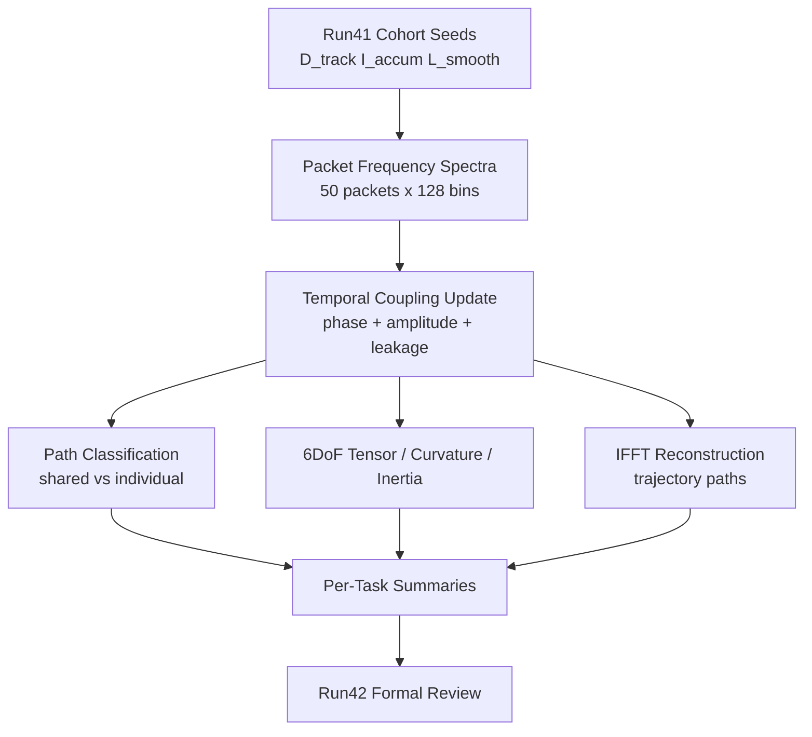

# Run 042 Observation Diagram

## Legend
- shared: phase-locked packets above dynamic lock threshold
- individual: packets outside the shared lock threshold
- recurrence alignment: dominant lag correlation over cohort lattice-distance series
